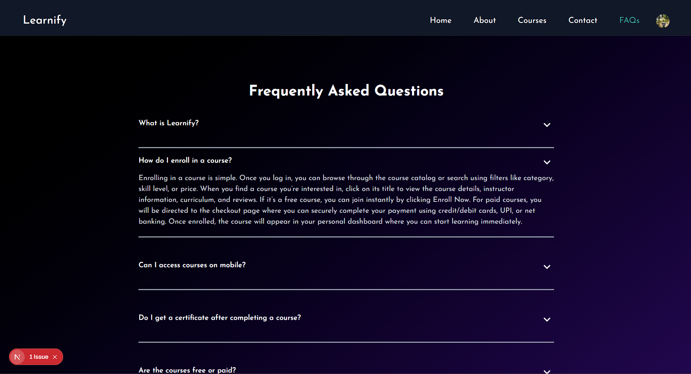

# 🚀 Learnify - Learning Management System

## 🌟 Introduction

Learnify is a comprehensive Learning Management System (LMS) built with modern technologies. It provides a robust platform for creating, managing, and delivering online courses with features like user authentication, course management, real-time notifications, and advanced administrative controls.

## ✨ Features

### 👥 User Management

- Secure user registration and login system
- Email verification for account activation
- Social authentication integration
- JWT-based authentication with access token refresh
- Profile management with avatar upload
- Password reset functionality

### 📚 Course Management

- Course creation and editing interface
- Rich content management system
- Course preview functionality
- Student enrollment system
- Progress tracking
- Q&A section with threaded discussions
- Course review and rating system

### 💡 Learning Experience

- Intuitive course navigation
- Interactive content delivery
- Question and answer forum
- Course reviews and ratings
- Progress tracking
- Personalized dashboard

### 👨‍💼 Administration

- Comprehensive admin dashboard
- User management system
- Course oversight and moderation
- Team member management
- Analytics and reporting
  - Last 28 days user statistics
  - Annual order analytics
  - Notification metrics

### 🎨 Content Customization

- Dynamic layout management
- FAQ management
- Hero banner customization
- Course category organization
- Responsive design

### ⚙️ Technical Features

- Advanced caching system
- Real-time notifications
- Cloud-based media management
- Redis integration
- Secure payment processing
- Automated notification cleanup
- Error handling system

## 🌐 Live Preview

[Visit Learnify](https://learnify-green-ten.vercel.app/)

## 🛠️ Tech Stack

### Frontend

- Next.js
- Redux Toolkit
- TailwindCSS
- Socket.io-client

### Backend

- Node.js
- Express.js
- MongoDB
- Redis
- Socket.io

### Cloud Services

- Cloudinary (Media Management)
- JWT (Authentication)
- OAuth (Social Login)

### Development Tools

- JavaScript
- ESLint
- Prettier
- Git

## 📱 Screenshots

<table>
  <tr>
    <td width="50%">
  
  
Landing Page

</td>
    <td width="50%">
  
  
Course Creation Page

</td>
  </tr>
  <tr>
    <td width="50%">
  
  
Course Page

</td>
    <td width="50%">
  
  
UI of player used for content delivery

</td>
  </tr>
  <tr>
    <td width="50%">
  
  
FAQs

</td>
  </tr>
</table>

## 📱 Admin Side Screenshots

<table>
  <tr>
    <td width="50%">
      
      
Analytics Page

    </td>
  </tr>

</table>